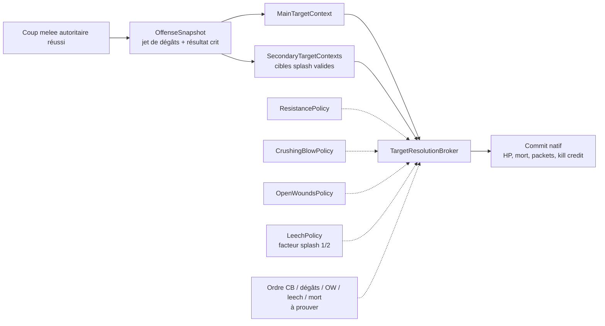

# Audit Mechanics 2.0 — Project Diablo 2 vs BKVince

## Socle des treize sections `Game Mechanics` et annexes combat

- Date de l’audit : 8 août 2026
- Statut : audit documentaire complet; aucune mécanique de gameplay n’a été implantée
- Audience : Vincent, ChatGPT Pro et futurs agents du Workspace RuffnecKk

## 0. Fondation gouvernée Mechanics 2.0

### 0.1 Source, frontière et résultat

La source normative est la page officielle
[PD2 — Game Mechanics, révision 23934](https://wiki.projectdiablo2.com/wiki/Game_Mechanics?oldid=23934),
horodatée `2026-07-18T16:30:25Z`. L’API MediaWiki officielle confirme que
`23934` est encore la révision courante le 8 août 2026 et expose exactement
treize sections de niveau supérieur. Le miroir chinois, révision `24127` du
25 juillet 2026, a été utilisé uniquement comme contrôle de lisibilité; il ne
remplace pas la révision officielle épinglée.

Ce lot ferme **l’audit**, pas l’implantation. Il n’écrit aucune table BKVince,
n’installe aucun hook, ne change aucune configuration et ne déploie rien dans
le runtime. Le melee splash déjà en cours conserve son propriétaire et son
séquencement; la présente fondation le relie seulement aux contrats partagés de
crit, leech, résistances, Open Wounds et Crushing Blow.

> **Erratum de gouvernance — 8 août 2026.** La décision MEC-00/MEC-01 prise
> après cet audit remplace la phrase précédente : le prototype gameplay
> `MeleeSplash` est désormais quarantiné comme hypothèse non probante. Il ne
> conserve aucun propriétaire ni séquencement de production, et ne peut être
> bâti, déployé, testé, publié ou utilisé comme témoin avant fermeture des
> preuves natives. Les contrats courants sont définis dans
> `mechanics-contracts.md` et `mechanics-native-proof-92777.md`.

> **Décision produit supersédante — 9 août 2026.** Vincent autorise une nouvelle
> mission `MeleeSplash.dll` v0.1, publique, générique, autonome et distincte de
> l'ancien prototype, qui demeure une hypothèse historique non probante. La
> portée initiale est limitée à D2R 3.2.92777 offline/local single-player,
> joueur contre monstres; multijoueur et PvP sont hors portée actuelle. La
> preuve `LIKELY_FRAGMENTED` autorise seulement le reverse engineering ciblé et
> la composition de coutures individuellement validées, sans sélectionner
> `Pd2CombatCore` ni transférer au splash la propriété des formules générales.
> La roadmap produit retient Critical 75 %/×2,0 avant Deadly 75 %/×1,5;
> Crushing Blow PD2 avec scaling, catégories et CBE; Open Wounds 5 secondes,
> trois stacks, résistance physique, règles boss/pets et DPS plat; puis le
> resolver hybride Sunders 95, breakers à demi-efficacité, pierce après bris,
> moitié de la partie négative et plancher −100. Après MeleeSplash viennent,
> dans cet ordre, Critical/Deadly, CB/CBE, OW/DPS plat, résistances, puis
> itemisation et équilibrage. Aucune de ces quatre refontes générales n'est
> implantée par la mission MeleeSplash v0.1.
>
> **Décision d'application splash — 9 août 2026.** Le paquet offensif de base
> reste partagé, mais Critical/Deadly, Crushing Blow et Open Wounds sont roulés
> indépendamment pour chaque cible secondaire. Pour Critical/Deadly, la v0.1
> reproduit seulement l'ordre et les chances actuellement autoritaires de
> 92777 derrière un adaptateur remplaçable; elle n'implante pas encore les caps
> ou multiplicateurs PD2 du futur lot général.

Les quatre dispositions ont un sens strict :

| Disposition | Signification dans cet audit |
|---|---|
| `baseline_only` | Loi moteur ou référence commune à conserver comme contrat de calcul/test; aucun port gameplay |
| `adapt` | Concept PD2 utile et isolable pour BKVince, à ouvrir plus tard dans un lot explicite et réversible |
| `reject` | Divergence PD2 volontairement non retenue parce qu’elle dégrade ou contourne le modèle D2R/BKVince |
| `needs_re` | Direction ou route native insuffisamment prouvée sous `D2R.exe 3.2.92777`; aucune implantation autorisée |

`adapt` n’autorise pas une mutation. La décision produit, les preuves requises
et la matrice runtime restent propres à chaque futur lot.

Le catalogue général conserve volontairement son schéma v1 : `baseline_only`
correspond à une absence de candidat ou à `keep_bkvince`, `adapt` se traduit
par `adapt_retune` lorsqu’un candidat économique est créé, tandis que `reject`
et `needs_re` gardent le même sens. La matrice ci-dessous reste propriétaire des
quatre dispositions Mechanics 2.0; migrer tout le catalogue uniquement pour
dupliquer ces libellés n’apporterait aucun gain de validation démontré.

### 0.2 Matrice exhaustive des treize sections

| # | Section officielle | Couche réelle | État BKVince prouvé | Disposition | Route et frontière |
|---:|---|---|---|---|---|
| 1 | Numbers (Rounding) | Baseline moteur | Aucun override global identifié; les tables et formules BKVince consomment déjà des entiers et du fixe `1/256` | `baseline_only` | Contrat documentaire et vecteurs de test; aucun fichier gameplay |
| 2 | Melee Splash | PD2 core | Splash BKVince par skill/missile à 50 %, distinct du resolver serveur PD2 | `needs_re` | Chantier melee existant uniquement; aucune nouvelle implantation dans Mechanics 2.0 |
| 3 | Dual Wielding | Baseline locale/globale + règle de vitesse PD2 | Aucune preuve 92777 du sélecteur global; l’audit Breakpoints prouve le risque du contournement offhand | `reject` | Rejeter `IAS - WSM` comme règle globale; conserver la séparation local/global comme contrat à vérifier |
| 4 | Critical Damage | PD2 core | `item_deadlystrike` ID 141 et `passive_critical_strike` ID 337 existent; caps et multiplicateurs PD2 absents | `needs_re` | Futur resolver serveur hybride, nouveaux stats collision-safe et preuve de l’ordre CS puis DS |
| 5 | Life and Mana Steal | Baseline moteur + exceptions PD2 | Stats historiques, divisors `1/2` Nightmare et `1/3` Hell, et `Drain` monstre présents | `baseline_only` | Conserver la formule de base; traiter les réductions propres aux skills dans leurs audits, jamais par port global |
| 6 | Crushing Blow | PD2 core | Chance ID 136/event 16 présente; CBE, nouveaux diviseurs et handler 92777 absents | `needs_re` | Annexe Partie II; futur lot serveur autoritaire après preuve native |
| 7 | Open Wounds | PD2 core | Chance ID 135/event 15 et état 62 présents; trois stacks, 5 s, DPS plat et handler 92777 absents | `needs_re` | Annexe Partie I; lifecycle serveur et nouveaux stats à prouver |
| 8 | Curse Duration / Resistance | PD2 core | Réduction de durée déjà itemisée via `curse_resistance` ID 109; réduction d’effet PD2 absente | `needs_re` | Préserver l’ID existant; nouveau stat/consommateur natif et cap 75 à prouver sans copier l’ID PD2 |
| 9 | Resistances | PD2 core | Cap élémentaire 95, cap physique 50; les deux sites PluginPack sont gouvernés | `adapt` | Futur lot de configuration isolé pour le cap élémentaire 90; aucune dépendance aux breakers |
| 10 | Reducing Resistances | PD2 core | Resolver D2R gouverné, mais patch BKVince permissif `0x44F8F1`; provenance des sources et ABI incomplètes | `needs_re` | Annexe Partie III; remplacer atomiquement le patch seulement après preuve de la composition Sunder/breaker/pierce |
| 11 | Item drop mechanics | Baseline moteur + PD2 core; SP+ séparé | BKVince démarre en `p1` et ses deux TC témoins reproduisent les probabilités LoD, pas la baseline solo PD2 | `adapt` | Retune data-only ciblé des TC après baseline économique; l’accélération SP+ reste un lot distinct |
| 12 | Distance | Baseline moteur | Aucun système BKVince concurrent; les rayons restent exprimés en coordonnées moteur | `baseline_only` | Standardiser `3 tiles = 2 yards`; ne pas importer les distances d’écran propres au client PD2 |
| 13 | Movement Speed | Renvoi documentaire | La section ne contient aucune règle, seulement un lien vers Faster Run/Walk Thresholds | `baseline_only` | L’audit Breakpoints reste propriétaire; toute évolution de formule repasse en `needs_re` |

Répartition fermée : `4 baseline_only + 2 adapt + 1 reject + 6 needs_re = 13`.
Aucune section n’est sans disposition.

### 0.3 Ce qui devient immédiatement un contrat commun

#### Arrondis et fixe `1/256`

PD2 documente une troncature à **chaque étape** pour les calculs entiers :
dégâts instantanés, résistances, affixes par niveau, or, expérience, défense,
attaque, chances et leech. Les dégâts par frame, HP/mana/stamina, coûts et
récupérations, vélocité joueur et vitesse des projectiles utilisent au contraire
une précision en `1/256`, même si l’UI affiche souvent un entier.

Pour BKVince, cette section n’est pas une fonctionnalité à porter. Elle impose
les règles suivantes à tout futur lot :

- reproduire l’ordre des opérations avant de comparer des résultats;
- tronquer au même endroit que le moteur, pas seulement à la fin;
- conserver les unités fixes jusqu’au dernier consommateur natif;
- séparer résultat gameplay et valeur affichée;
- inclure des vecteurs pairs, impairs, négatifs et limites dans les tests.

Cette contrainte s’applique notamment aux breakers `1/2`, au leech, à Crushing
Blow, aux trois stacks Open Wounds et au bonus de rayon par tranches complètes.

#### Life/Mana Steal

[`difficultylevels.txt`](../data-BKVince/BKVince.mpq/data/global/excel/difficultylevels.txt)
prouve les mêmes divisors structurants que la page PD2 : `1/1` en Normal,
`1/2` en Nightmare et `1/3` en Hell, pour la vie comme pour la mana. Les stats
historiques `lifedrainmindam` et `manadrainmindam` sont déjà itemisées, et
`monstats.txt` porte `Drain`, `Drain(N)` et `Drain(H)` par monstre.

La formule publiée applique, avec troncatures intermédiaires, le pourcentage de
leech, la réduction attaque, la réduction skill, la difficulté, les dégâts
physiques réellement infligés et le Drain Effectiveness. Le ranged et le melee
splash valent `1/2`; Blade Shield `1/2`, Blade Fury `3/4` et Leap Attack `1/3`
pour la vie. Ces exceptions de skill sont des comportements PD2 à revalider
contre chaque skill BKVince; elles ne justifient aucun remplacement global du
leech actuel.

Disposition : conserver le socle (`baseline_only`). Le demi-leech du splash
reste une dépendance du chantier melee, et l’absence de RVA `Leech` gouvernée
interdit d’en déduire un point de hook.

Le snapshot contient aussi `lifedrain_percentcap` ID `488`, mais la révision
`Game Mechanics` ne documente pas ce stat. Sa provenance reste inconnue entre
PD2 core et la surcouche SP+; il est exclu du socle au lieu d’être présenté
comme une dépendance du leech.

#### Distance et mouvement

La convention normative est :

```text
yards = tiles × 2 / 3
tiles = yards × 3 / 2
```

Les rayons de skills, auras et splash doivent être spécifiés en tiles côté
moteur et seulement présentés en yards côté joueur. Les distances aux bords de
l’écran publiées par PD2 dépendent de son client élargi `1068×600`; elles ne
sont pas des constantes D2R/BKVince.

La section Movement Speed n’ajoute aucun algorithme. Elle délègue au chapitre
Faster Run/Walk Thresholds. Le chantier Breakpoints séparé reste propriétaire
de ce sujet; son rapport local n’est pas livré dans ce checkpoint Mechanics
2.0. Les conclusions nécessaires sont conservées ici : BKVince possède
`item_fastermovevelocity`, aucun override global n’est identifié, et toute
modification de formule exige une preuve 92777 avant de quitter
`baseline_only`.

### 0.4 Dual wield : merger le contrat, rejeter le contournement

La page contient deux sujets différents :

1. une taxonomie de stats locales/globales, largement héritée du moteur;
2. une règle PD2 qui sélectionne l’arme par `IAS - WSM` pour **toutes** les
   attaques et permet à une offhand de contourner la vitesse de l’arme utilisée.

Le second sujet est rejeté. Il est transversal, non exprimable par les TXT,
sans owner 92777 gouverné, et le propre exemple PD2 montre qu’il peut choisir
l’arme produisant l’attaque la plus lente. Il entrerait aussi en conflit avec le
modèle D2R moderne déjà conservé pour Whirlwind et les wereforms.

La taxonomie reste un contrat d’audit : AR, dégâts plats d’arme, ED local,
min/max, IAS, leech, CB/CBE, OW, Critical/Deadly et pierce physique sont locaux
à l’arme attaquante; skills/stats/vie/mana/défenses, bonus de dégâts de skill
élémentaire, pierce non physique et DPS plat Open Wounds sont globaux. La page
elle-même qualifie le multiplicateur Critical/Deadly de « probably local » :
ce point reste une hypothèse, pas une règle BKVince.

### 0.5 Critical Damage : surface native non prouvée

PD2 sépare :

- Critical Strike : cap par défaut `75 %`, multiplicateur `2,0`;
- Deadly Strike : cap par défaut `75 %`, multiplicateur `1,5`;
- Critical Strike testé en premier, puis Deadly Strike seulement si Critical a
  échoué;
- multiplicateurs additionnels propres aux deux familles et bonus au cap DS.

Le snapshot PD2 ajoute `item_maxdeadlystrike` ID 210,
`item_crit_multiplier` ID 256, `item_ds_multiplier` ID 257 et
`item_crit_chance` ID 258. BKVince conserve seulement les fondations
historiques `item_deadlystrike` ID 141 et `passive_critical_strike` ID 337.
Les IDs PD2 ne sont jamais transposés : ils doivent être réservés dans le
graphe BKVince, avec Save/Send bits stables et migration d’anciens objets.

Le registre 92777 ne possède actuellement aucun handler `Critical` ou `Deadly`
gouverné. Il faut prouver le point du jet, l’ordre, le cap, le multiplicateur,
le périmètre physique, la propriété locale/globale et la propagation au splash.
Jusqu’à cette preuve, la disposition est `needs_re`, sans changement de stat ni
d’itemisation.

### 0.6 Curse Duration / Resistance : préserver l’existant, ne pas confondre

BKVince possède déjà :

- `curse_resistance`, ID `109`, Save Bits `9`;
- la propriété `res-curse`;
- Fade et de nombreux items/sets/recettes qui l’itemisent, parfois jusqu’à
  `100 %`.

Cette stat correspond à la **réduction de durée**. PD2 conserve cette famille
et ajoute séparément `curse_effectiveness`, ID PD2 `504`, via la propriété
`curse-effectiveness`, pour réduire la **magnitude** de la malédiction. PD2
borne chacune des deux réductions à `75 %`.

Une fusion brute écraserait donc un format et une économie déjà publiés. Le
futur lot doit conserver l’ID 109, décider comment retuner les valeurs BKVince
supérieures à 75, réserver un nouvel ID collision-safe pour l’efficacité et
prouver où le moteur construit les statlists de malédiction. Aucun handler
`Curse` n’est gouverné sous 92777 : disposition `needs_re`, route hybride et
autorité serveur obligatoire.

### 0.7 Resistances : deux lots qui ne doivent pas être confondus

Le simple plafond défensif est isolable. `plugin-items` gouverne déjà les
immédiats `0x4524D6` (physique 50) et `0x4524DE` (élémentaire 95), mais les deux
options sont désactivées dans `D2RPlugins.json`. Adopter plus tard le plafond
PD2 de `90` est une adaptation de configuration réversible, sans changement de
sauvegarde. Elle ne prouve et ne modifie aucun breaker.

La réduction offensive reste `needs_re`. BKVince active le patch permissif
`0x44F8F1`; PD2 exige au contraire breakers à demi-efficacité contre 100+,
pierce seulement après bris, moitié de la seule partie négative et plancher
`-100`. La Partie III démontre pourquoi Sunder, breaker, pierce et ce patch
doivent avoir un seul owner et être remplacés atomiquement.

### 0.8 Item drops : PD2 core d’abord, Single Player Plus ensuite

La page officielle décrit la baseline **PD2 core** : le nombre de joueurs agit
sur NoDrop et donc la quantité potentielle, pas directement sur la qualité;
le solo PD2 est environ vanilla `p5/5`, puis continue à progresser jusqu’à huit
joueurs. Les rune TCs restent annoncées comme vanilla.

Le profil BKVince actif porte `"Offline Difficulty Scaling": 1`. Il s’agit
d’une observation locale datée, pas d’une configuration versionnée; le
`Settings.json` observé porte le SHA-256
`16102EB8E006F0ADBD57CE70E319FC9163F3D0F7E67BDF0F95B5640E89827AC8`.
Deux témoins communs aux tables prouvent la frontière :

| Treasure Class | BKVince p1 | PD2 p1 | Preuve brute `NoDrop / somme poids` |
|---|---:|---:|---|
| `Swarm 2 (H)` | `83,33 %` | `40,85 %` | BKVince `125/25`, PD2 `415/601` |
| `Act 2 (H) H2H A` | `62,50 %` | `9,52 %` | BKVince `100/60`, PD2 `95/903` |

BKVince suit ici les valeurs LoD publiées, pas la baseline solo PD2. Le delta
est directement visible dans `treasureclassex.txt`; la route du **retune de
NoDrop** est donc data-only et ne dépend pas d’un nouveau handler. En revanche,
sa valeur est économique et doit être mesurée sur l’ensemble des TC, boss,
coffres, clés, organes, rifts et contenus custom avant toute écriture.

L’affirmation wiki « rune TCs identiques à vanilla » n’autorise pas non plus un
remplacement : sur `Runes 17`, le poids de downgrade vaut `5170` en vanilla
3.2, `3708` dans BKVince et `1034` dans le snapshot SP+. BKVince possède donc
déjà sa propre économie de runes, située entre les deux sources.

La surcouche `spplus-drop-acceleration` reste séparée. Elle modifie aussi les
récompenses solo et son README annonce une accélération supplémentaire; la
fusionner avec le socle p5-like empêcherait d’attribuer les effets et risquerait
de doubler l’accélération. `itemratio.txt` du snapshot ne constitue pas une
preuve de cette surcouche puisqu’il est byte-logiquement identique au vanilla
3.2 dans la comparaison normalisée. Disposition du socle PD2 : `adapt`;
disposition de SP+ : candidat économique distinct, non autorisé par Mechanics
2.0.

### 0.9 Inventaire consolidé des nouveaux stats et collisions

BKVince occupe actuellement les IDs `0..390` dans `itemstatcost.txt`. Les IDs
du snapshot sont des ordinals propres à sa table et ne sont jamais une réserve
transposable :

| Concept du snapshot | ID source | État au même ID BKVince | Décision Mechanics 2.0 |
|---|---:|---|---|
| Open Wounds stack | 189 | `item_pierce_fire_immunity` | compteur transitoire serveur; ne pas sérialiser cet ID |
| Maximum Deadly Strike | 210 | `ua_escalation` | nouvel ID persistant seulement après preuve du cap |
| Critical multiplier | 256 | `item_slash_damage` | collision; futur stat collision-safe |
| Deadly multiplier | 257 | `item_slash_damage_percent` | collision; futur stat collision-safe |
| Critical chance item | 258 | `item_crush_damage` | collision; futur stat collision-safe |
| Crushing Blow Efficiency | 268 | `item_armor_bytime` | collision; futur stat collision-safe |
| Melee splash gate source | 359 | `skill_cooldown` | conserver le gate BKVince `item_splashonhit` ID 384 |
| Increased splash radius | 478 | hors plage BKVince | futur stat seulement dans le chantier melee propriétaire |
| Life leech percent cap | 488 | hors plage BKVince | exclu : non documenté par `Game Mechanics` |
| Open Wounds DPS plat | 501 | hors plage BKVince | futur stat persistant après preuve du consommateur |
| Curse effectiveness | 504 | hors plage BKVince | futur stat persistant après preuve du handler |

Toute publication d’un nouveau stat exige réservation permanente, Save/Send
bits gouvernés, test d’anciens objets et conservation de l’ID même après
rollback. Le rollback rend le consommateur inerte; il ne réalloue jamais l’ID.

### 0.10 Backlog natif et ordre de merge

Le workbench vérifié du build 92777 ne retourne aucun owner gouverné pour
`Deadly`, `Leech`, `Curse`, `NoDrop` ou `Crushing`; `Wounds` ne retourne que le
patch de kill credit périodique. Les preuves positives disponibles sont le
resolver `SUNITDMG_ApplyResistancesAndAbsorb 0x4523E0`, les deux sites de caps,
le patch permissif `0x44F8F1` et l’observateur post-résolution `0x427150` qui
doit rester la propriété de FloatingDamage.

L’ordre de merge gouverné devient :

1. appliquer dès maintenant les contrats `baseline_only` aux audits et tests;
2. reprendre General Changes / QoL / balance sans modifier les six surfaces
   `needs_re`;
3. ouvrir séparément, sur décision produit, le cap élémentaire 90 et la
   baseline de drop PD2, avec mesures et rollback propres;
4. traiter chaque surface native dans le workbench 92777, puis demander le gate
   d’incubation approprié avant toute nouvelle DLL;
5. laisser le melee en cours consommer ces contrats sans le redémarrer ni le
   dupliquer dans cette mission.

Le gate Mechanics 2.0 est ainsi fermé documentairement. Les six entrées
`needs_re` restent volontairement ouvertes comme backlog technique; leur
présence n’empêche pas la reprise du chapitre General/QoL, mais interdit tout
port implicite de ces mécaniques.

## 1. Conclusion exécutive

Les annexes combat ci-dessous approfondissent Open Wounds, Crushing Blow,
résistances et melee splash. Leur ancien périmètre excluait volontairement les
drops, Treasure Classes et NoDrop; Mechanics 2.0 les couvre désormais dans la
section 0.8 sans les mélanger au noyau combat. BKVince démarre en
`p1` par défaut : le profil actif porte
`"Offline Difficulty Scaling": 1`. Les valeurs `p2` à `p8` présentes plus
loin servent uniquement à comparer le scaling de Crushing Blow; elles ne
décrivent pas le démarrage de BKVince.

Les quatre conclusions structurantes sont les suivantes :

1. **Open Wounds BKVince demeure vanilla-like.** Les tables prouvent les stats,
   propriétés, états et event functions historiques. Aucun patch BKVince
   identifié ne remplace sa formule. La courbe sémantique LoD produit
   `306,25 DPS` au niveau 99 pendant 8 secondes; PD2 publie une courbe
   correspondante, mais ramène la durée à 5 secondes, autorise trois stacks,
   applique la résistance physique, supprime l’ancienne pénalité contre les
   boss et ajoute du DPS plat itemisé.
2. **Crushing Blow PD2 n’est pas un simple changement de chance.** Sur un
   monstre ordinaire en `p1`, la fraction melee passe de `25 %` de la vie
   courante dans le modèle LoD à `12,5 %` dans PD2. PD2 change également le
   ranged, le scaling joueurs, les Prime Evils, les map bosses et ajoute
   Crushing Blow Efficiency. Les chances restent softcode; la formule est
   hardcode.
3. **Le modèle de résistances est le conflit le plus important.** PD2 sépare
   strictement les effets `reduce/lower`, seuls capables de casser une
   immunité, du `pierce/penetrate`, applicable seulement après le bris.
   BKVince charge au contraire un patch qui force le chemin
   `-Enemy Resistance` à s’exécuter aussi contre une résistance `>= 100`.
   Conserver ce patch signifie vraisemblablement conserver un modèle plus
   permissif que PD2.
4. **Un vrai melee splash PD2 ne peut pas être prouvé par le missile actuel.**
   L’annexe historique esquisse un noyau serveur `Pd2CombatCore`, mais Mechanics
   2.0 ne le promeut pas : la propriété local/global, le resolver
   Critical/Deadly, le leech et les coutures CB/OW restent sans preuve 92777.
   Une architecture commune ne redeviendra candidate qu’après identification de
   ces propriétaires et vérification qu’un même point d’autorité les gouverne.

La recommandation ferme est de ne copier ni tables ni IDs PD2. Si Vincent
confirme plus tard un chantier natif, le choix entre intégration commune et
consommateurs séparés devra être repris à partir des preuves 92777, avec des IDs
BKVince propres, un chemin serveur autoritaire, des hooks fail-closed et une
validation solo puis hôte/joiner. Aucune RVA n’est encore gouvernée pour le
point d’injection melee, les handlers Crushing Blow/Open Wounds ou le leech.

## 2. Périmètre des annexes combat, sources et niveau de preuve

### 2.1 Périmètre

Les annexes numérotées 4 à 45 couvrent exclusivement :

- Open Wounds;
- Crushing Blow et Crushing Blow Efficiency;
- résistances, immunités, breakers, pierce et Sunders;
- conception d’un melee splash équivalent à PD2;
- répartition softcode, hardcode et hybride;
- architecture, compatibilité, sauvegardes, réseau, validation et rollback.

Le PvP est exclu, sauf lorsqu’une différence doit être signalée comme inconnue.
Les drops restent hors des annexes combat; leur audit de fondation se trouve en
section 0.8.

### 2.2 Sources principales

- [PD2 — Game Mechanics, révision 23934 du 18 juillet 2026](https://wiki.projectdiablo2.com/wiki/Game_Mechanics?oldid=23934);
- snapshot local PD2 Single Player Plus, commit épinglé
  `3debc6781f33c3c1474a995b80369a4e618cd386`;
- tables BKVince lues avec
  [`scripts/build-data/tsv.js`](../scripts/build-data/tsv.js), avec round-trip
  byte-exact avant extraction;
- atelier gouverné
  [D2R 3.2.92777](../reverse-engineering/d2r-3.2.92777/known-rvas.json);
- D2MOO au commit
  `19019806df7f3e877fa105b05395d1e3597e2316`, uniquement comme référence
  sémantique Diablo II 1.10f.

Le `p1` de départ a été vérifié dans le profil actif :
`C:\Users\Vincent Barrière\Saved Games\Diablo II Resurrected\mods\BKVince\Settings.json`,
ligne 66, SHA-256 observé
`16102EB8E006F0ADBD57CE70E319FC9163F3D0F7E67BDF0F95B5640E89827AC8`.
Cette configuration locale n’est pas une source versionnée. Le wiki épinglé
gouverne les comportements attribués à PD2. Le
snapshot Single Player Plus sert de preuve locale des lignes et valeurs
présentes dans cette distribution; une ligne locale seule ne prouve pas si elle
provient du cœur PD2 ou de la surcouche Single Player Plus.

Le gate du workbench 92777 est vert :

- image canonique SHA-256
  `CC59119DC2A6C7D43D088098FC162EAFA4AE1299B2079126AEF43C1ACA914715`;
- image d’analyse SHA-256
  `673E8C0B2E89563E75525B24D137098EFD07B2DB4ED42ADEC56AA1ADDF0E63AB`;
- image canonique, image d’analyse, index et projet persistant vérifiés.

### 2.3 Hiérarchie de preuve utilisée

| Niveau | Signification |
|---|---|
| **Prouvé localement** | Ligne TXT, configuration, patch, octets, fonction ou RVA gouvernée dans le workspace |
| **Documenté PD2** | Comportement publié dans la révision wiki épinglée |
| **Inférence forte** | Identité très probable de BKVince avec le comportement LoD/D2R, sans handler 92777 encore identifié |
| **Inconnu** | Ordre, arrondi, ABI, hook ou comportement qui exige une preuve statique supplémentaire ou un témoin runtime |

Une formule D2MOO ne prouve jamais une adresse, une ABI, une structure ou un
ordre bit-exact dans D2R 3.2. Elle est utilisée ici pour expliquer le
comportement historique que les tables BKVince continuent de sélectionner.

### 2.4 Vocabulaire d’implantation

| Route | Définition |
|---|---|
| **Softcode** | Valeurs exprimables dans les TXT ou une configuration déjà consommée par le moteur |
| **Hardcode-backed** | Hook ou patch existant, pilotable par configuration |
| **Hardcode** | Nouvelle logique native dans un patch mémoire ou un plugin |
| **Hybride** | Stat/propriété/itemisation TXT avec consommateur natif autoritaire |

## 3. Matrice de décision des annexes combat

| Mécanique | BKVince actuel | PD2 ciblé | Route réelle | Verdict |
|---|---|---|---|---|
| Open Wounds | Stat vanilla, 8 s présumées, un état; aucun calcul modifié par les patches connus | 5 s, 3 stacks, résistance physique, DPS plat, règles boss/pets | Hybride | Fort potentiel de build, mais nouveau lifecycle serveur requis |
| Crushing Blow | Chance vanilla et formule LoD présumée | Nouveaux diviseurs, ranged ×1,5, scaling, Prime Evil dynamique, CBE | Hybride | Bon contrôle des boss si implanté avec OW/splash |
| Immunités | Sunders D2R + patch permissif contre `>=100` | Breakers à demi-efficacité; pierce seulement après bris | Hardcode conflictuel | Décision de philosophie obligatoire |
| Résistance négative | Plancher `-100`; aucune division PD2 identifiée | Partie négative finale divisée par deux, puis plancher `-100` | Hardcode | À intégrer avec le resolver d’immunité |
| Melee splash | Skill + missile radial, 50 % source, NHD présent | AoE serveur 360°, paquet pré-critique partagé, CS/DS/CB/OW par cible, demi-leech | Hardcode + TXT | Le missile actuel ne permet pas la parité |

---

# Partie I — Open Wounds

## 4. Fondations BKVince prouvées

Les tables BKVince sont byte-exactes au round-trip et restent en CRLF.

| Élément | Preuve BKVince | Valeur |
|---|---|---|
| Stat | [`itemstatcost.txt`](../data-BKVince/BKVince.mpq/data/global/excel/itemstatcost.txt), ligne 137 | `item_openwounds`, ID `135`, Save Bits `7` |
| Événement melee | même ligne | `domeleedamage`, event function `15` |
| Événement missile | même ligne | `domissiledamage`, event function `15` |
| Propriété | [`properties.txt`](../data-BKVince/BKVince.mpq/data/global/excel/properties.txt), ligne 109 | `openwounds` → `item_openwounds` |
| État | [`states.txt`](../data-BKVince/BKVince.mpq/data/global/excel/states.txt), ligne 64 | `openwounds`, ID `62` |

Le patch
[`thorns-and-burn-kill-credit.json`](../data-BKVince/d2rloader/patches/thorns-and-burn-kill-credit.json)
conserve Poison et Open Wounds dans la lookup vanilla du propriétaire des
dégâts périodiques létaux, puis y ajoute Burning. Il remplace aussi la lecture
dword par une lecture byte et étend la boucle de deux à trois états. Ses sites
`0x448DCA` et `0x448DE5` ne modifient aucun calcul Open Wounds et ne prouvent ni
la formule, ni la durée, ni les stacks.

Aucun patch BKVince identifié ne remplace l’event function 15. La conclusion
prudente est donc : **BKVince conserve les sélecteurs vanilla et aucun
remplacement natif n’est connu**, mais le handler exact D2R 3.2.92777 reste à
identifier avant d’affirmer une identité bit-exacte.

## 5. Courbe de dégâts vanilla-like

La référence sémantique D2MOO
[`SkillItem.cpp`](<../../D2MOO-reference/source/D2Game/src/SKILLS/SkillItem.cpp>)
calcule un débit interne `R(L)` en unités de `1/256 HP par frame` :

```text
R(L) = 9L + 31       pour L = 1..15
R(L) = 18L - 104     pour L = 16..30
R(L) = 27L - 374     pour L = 31..45
R(L) = 36L - 779     pour L = 46..60
R(L) = 45L - 1319    pour L >= 61

DPS réel = 25 × R(L) / 256
```

Le tableau DPS publié par PD2 correspond exactement à cette courbe aux niveaux
vérifiés. Cela ne prouve pas que le code natif PD2 est identique; cela prouve
que les chiffres publiés sont compatibles avec la formule historique.

| Niveau attaquant | `R(L)` interne | DPS interne exact | DPS entier affichable |
|---:|---:|---:|---:|
| 1 | 40 | 3,90625 | 3 |
| 25 | 346 | 33,7890625 | 33 |
| 50 | 1 021 | 99,70703125 | 99 |
| 75 | 2 056 | 200,78125 | 200 |
| 99 | 3 136 | 306,25 | 306 |

Le moteur conserve la fraction `1/256`. Il serait donc incorrect de calculer
les totaux avec le seul nombre entier affiché.

## 6. Durée et total théorique BKVince vs PD2

La référence vanilla applique Open Wounds pendant `200 frames`, soit
`8 secondes` à 25 FPS. PD2 documente `5 secondes`, soit `125 frames`, et
jusqu’à trois stacks.

| Niveau | BKVince vanilla-like, 8 s | PD2, 1 stack pendant 5 s | PD2, maximum nominal de 3 stacks |
|---:|---:|---:|---:|
| 1 | 31,25 | 19,53125 | 58,59375 |
| 25 | 270,3125 | 168,9453125 | 506,8359375 |
| 50 | 797,65625 | 498,53515625 | 1 495,60546875 |
| 75 | 1 606,25 | 1 003,90625 | 3 011,71875 |
| 99 | 2 450 | 1 531,25 | 4 593,75 |

Ces nombres sont des **intégrales théoriques sans résistance, pénalité, bonus
plat, interruption ni différence de tick d’expiration**. Une stack PD2
représente nominalement `62,5 %` du total 8 secondes. Trois stacks représentent
au maximum `187,5 %`, mais le résultat réellement observé dépend du stacking,
du refresh, des arrondis et du nombre exact de ticks.

## 7. Différences comportementales

| Règle PvE | BKVince vanilla-like | PD2 documenté |
|---|---|---|
| Durée | 8 s, inférence forte | 5 s |
| Nombre de stacks | Un état historique; pas de compteur exposé | Jusqu’à 3 |
| Résistance physique | Non consultée dans le handler D2MOO de référence | Appliquée |
| Champion/unique/superunique/boss | Ancienne pénalité de moitié dans la référence | Pénalité supprimée |
| Mercenaire ou pet comme cible | Aucune branche dédiée visible dans le handler D2MOO | Dégâts divisés par 4 |
| Bonus plat OW | Aucun stat consommé | `+X Open Wounds Damage per Second` |
| Attacker Takes Damage | Ne déclenche pas OW dans le handler historique observé | Peut appliquer OW |
| Kill credit périodique | OW déjà couvert par la lookup vanilla; le patch le conserve et ajoute Burning | Géré par la mécanique PD2 |

Le PvP, sa pénalité historique et la différence éventuelle melee/ranged OW ne
sont pas retenus dans ce chantier tant qu’une spécification PD2 actuelle et un
témoin 92777 ne les ont pas fixés.

### Exemple niveau 99

Sans bonus plat :

- BKVince vanilla-like, cible ordinaire : `306,25 DPS` pendant 8 s;
- ancienne cible boss à pénalité de moitié : débit nominal
  `153,125 DPS` avant les arrondis successifs du handler;
- PD2, cible à 0 % physique : `306,25 DPS` par stack pendant 5 s;
- PD2, trois stacks : `918,75 DPS` nominaux;
- PD2, cible à 50 % physique : `153,125 DPS` par stack, soit
  `459,375 DPS` nominaux à trois stacks.

L’effet d’une résistance physique négative, l’ordre exact des arrondis et le
point auquel le bonus plat est ajouté doivent être prouvés avant de figer le
consommateur BKVince.

## 8. Itemisation PD2 et BKVince

### 8.1 Exemples BKVince actuels

- The Gnasher :
  [`uniqueitems.txt`](../data-BKVince/BKVince.mpq/data/global/excel/uniqueitems.txt),
  ligne 2, `50 % Open Wounds` et `20 % Crushing Blow`;
- rune Um :
  [`gems.txt`](../data-BKVince/BKVince.mpq/data/global/excel/gems.txt),
  ligne 59, `25 % Open Wounds` dans une arme;
- rune Ber :
  même table, ligne 67, `20 % Crushing Blow` dans une arme.

### 8.2 Exemples PD2

Le snapshot PD2 donne à la rune Um :

- `10 % Open Wounds`;
- `+120 Open Wounds Damage per Second`.

Le stat `deep_wounds` est réellement itemisé :

- préfixe d’arme `Gorelust's` : `407–563` DPS plat;
- suffixe `of Hematic` : `235–325` DPS plat;
- skill passif `Deep Wounds` : ajoute le stat et de la chance OW.

Cela transforme Open Wounds en axe de build. Copier seulement les trois stacks
sans l’itemisation plate ne reproduirait pas la mécanique PD2; copier les
valeurs plates sans refaire les boss et la résistance pourrait au contraire
surperformer fortement dans BKVince.

## 9. Nouvelles stats et collisions

Les IDs PD2 ne peuvent pas être copiés.

| Concept | ID PD2 | Collision BKVince |
|---|---:|---|
| `openwounds_stack` | 189 | `item_pierce_fire_immunity` |
| `item_crushingblow_efficiency` | 268 | `item_armor_bytime` |
| `item_splashonhit` | 359 | `skill_cooldown` |
| `deep_wounds` | 501 | Hors plage actuelle auditée; limite et sérialisation à prouver |

Preuves du snapshot local :

- [PD2 `itemstatcost.txt`](<../../PD2 Single PLayer/PD2-Single-Player-Plus-mod-main/data/global/excel/itemstatcost.txt>),
  lignes 191, 270 et 503;
- [PD2 `properties.txt`](<../../PD2 Single PLayer/PD2-Single-Player-Plus-mod-main/data/global/excel/properties.txt>),
  lignes 411 et 438;
- [PD2 `skills.txt`](<../../PD2 Single PLayer/PD2-Single-Player-Plus-mod-main/data/global/excel/skills.txt>),
  lignes 360 et 370.

Le snapshot PD2 sérialise `openwounds_stack` avec 5 bits. Pour BKVince, le
nombre de stacks devrait plutôt être un **état transitoire serveur lié à la
cible**, pas un stat persistant de personnage ou d’objet. Le DPS plat, CBE et
un éventuel rayon de splash sont au contraire des stats persistants qui exigent
des IDs collision-safe, des Save/Send bits gouvernés et une réservation
définitive après publication.

## 10. Softcode, hardcode et décision OW

### Softcode

- chance OW sur items, runes, affixes, sets, runewords et skills;
- valeurs du futur DPS plat une fois son stat créé;
- descriptions et tooltips;
- distribution par type d’objet.

### Hardcode

- durée 5 secondes;
- trois stacks et leur lifecycle;
- règles d’ajout, refresh, remplacement et quatrième application;
- application de la résistance physique;
- suppression des anciennes pénalités de boss;
- pénalité mercenaire/pet;
- application depuis Attacker Takes Damage;
- consommateur du DPS plat;
- ordre avec dégâts normaux, Crushing Blow, mort et kill credit.

### Hybride recommandé

- stat persistant collision-safe pour le DPS plat;
- stack records transitoires côté serveur;
- event handler commun appelé pour la cible principale et chaque cible splash;
- pipeline natif pour HP, mort, attribution et synchronisation;
- configuration désactivable sans supprimer ni réallouer les IDs publiés.

---

# Partie II — Crushing Blow

## 11. Fondations BKVince prouvées

| Élément | Preuve BKVince | Valeur |
|---|---|---|
| Stat | [`itemstatcost.txt`](../data-BKVince/BKVince.mpq/data/global/excel/itemstatcost.txt), ligne 138 | `item_crushingblow`, ID `136` |
| Événement melee | même ligne | `domeleedamage`, event function `16` |
| Événement missile | même ligne | `domissiledamage`, event function `16` |
| Propriété | [`properties.txt`](../data-BKVince/BKVince.mpq/data/global/excel/properties.txt), ligne 110 | `crush` → `item_crushingblow` |
| Roll historique | D2MOO 1.10f | `random(0..99) < chance` |

Une chance de `100 %` garantit donc le proc dans le modèle historique. La
chance détermine **si** Crushing Blow se produit; la nouvelle CBE détermine
**combien** il retire lorsqu’il proc. Ces deux leviers ne doivent pas être
confondus.

BKVince conserve les event functions et stats vanilla, et aucun patch identifié
ne modifie leur calcul. L’identité exacte du handler D2R 3.2 reste toutefois
une inférence forte tant que sa RVA et son ABI ne sont pas gouvernées.

## 12. Modèle LoD/BKVince actuel

Pour le modèle sémantique historique, avant résistance physique :

| Cible, p1 | Melee | Ranged |
|---|---:|---:|
| Monstre ordinaire | 1/4 = 25 % | 1/8 = 12,5 % |
| Boss ou superunique | 1/8 = 12,5 % | 1/16 = 6,25 % |
| Joueur ou mercenaire | 1/10 = 10 % | 1/20 = 5 % |

La fraction est calculée sur la **vie courante**, pas la vie maximale. Pour les
monstres hors mercenaires, le modèle historique augmente le diviseur avec le
bonus de vie du nombre de joueurs. Le ranged double ensuite le diviseur.

Le handler D2MOO applique le pourcentage de résistance physique positif, borné
à 100, mais pas la réduction physique plate. Il comporte un clamp à zéro et un
result flag si la réduction atteint la vie restante; avec les diviseurs
standards, Crushing Blow seul reste strictement inférieur à 100 % et ne tue
normalement pas.

## 13. Chiffres PD2 par catégorie

Valeurs `p1`, CBE 0, résistance physique 0 :

| Cible | Melee PD2 | Ranged PD2 | Melee LoD | Ranged LoD |
|---|---:|---:|---:|---:|
| Monstre ordinaire | 1/8 = 12,5 % | 1/12 = 8,3333 % | 25 % | 12,5 % |
| Superunique | 1/8 = 12,5 % | 1/12 = 8,3333 % | 12,5 % | 6,25 % |
| Prime Evil à pleine vie | 1/80 = 1,25 % | 1/120 = 0,8333 % | 12,5 % | 6,25 % |
| Map boss | 1/30 = 3,3333 % | 1/45 = 2,2222 % | Catégorie absente | Catégorie absente |
| Joueur ou mercenaire | 1/10 = 10 % | 1/15 = 6,6667 % | 10 % | 5 % |

PD2 emploie donc une pénalité ranged de `×1,5` sur le diviseur, contre
`×2` dans le modèle LoD. Cela rend le ranged PD2 relativement moins pénalisé,
même si la fraction de base contre un monstre ordinaire est divisée par deux.

La classification exacte des boss BKVince — en particulier les boss de rifts
ou contenus custom — doit être définie explicitement. Elle ne doit pas dépendre
d’un test fragile de nom ou d’un ID PD2.

## 14. Scaling du nombre de joueurs

### 14.1 Monstre ordinaire melee

| Joueurs | LoD/BKVince, diviseur | LoD/BKVince | PD2, diviseur effectif publié | PD2 |
|---:|---:|---:|---:|---:|
| p1 | 4 | 25 % | 8 | 12,5 % |
| p2 | 6 | 16,6667 % | 10,8 | 9,2593 % |
| p3 | 8 | 12,5 % | 12,2 | 8,1967 % |
| p4 | 10 | 10 % | 13,6 | 7,3529 % |
| p5 | 12 | 8,3333 % | 15 | 6,6667 % |
| p6 | 14 | 7,1429 % | 16,4 | 6,0976 % |
| p7 | 16 | 6,25 % | 17,8 | 5,6180 % |
| p8 | 18 | 5,5556 % | 19,2 | 5,2083 % |

La formule publiée par le wiki pour le scaling PD2 implique une exception
`p1` :

- `p1` : aucun ajout au diviseur de base 8;
- `p2..p8` : ajout de `1,4 × pCount`.

Appliquer mécaniquement `8 + 1,4 × pCount` à `p1` donnerait `1/9,4`, ce
qui contredit le `1/8` publié. L’implantation devra donc encoder et tester
l’exception au lieu de déduire une formule uniforme.

Ces valeurs `p2..p8` sont une matrice mécanique. Le profil BKVince actif
démarre en `p1`.

## 15. Prime Evils : rendement décroissant

PD2 documente :

```text
fraction CB = 1 / ((8 + pourcentage de vie manquante) × 10)
```

Hypothèses du tableau : `p1`, melee, CBE 0, résistance physique 0.

| Vie manquante | Diviseur | Pourcentage de la vie courante |
|---:|---:|---:|
| 0 % | 80 | 1,25 % |
| 25 % | 330 | 0,303030 % |
| 50 % | 580 | 0,172414 % |
| 75 % | 830 | 0,120482 % |
| 90 % | 980 | 0,102041 % |
| 99 % | 1 070 | 0,093458 % |

Exemple avec un Prime Evil ayant `1 000 000 HP` maximum :

- pleine vie : `1 000 000 / 80 = 12 500 HP`;
- à 50 % de vie restante : `500 000 / 580 ≈ 862 HP`;
- modèle LoD boss à ce même instant : `500 000 / 8 = 62 500 HP`.

Le pourcentage PD2 est appliqué à la vie **courante**. À 50 % de vie restante,
`1/580` de la vie courante ne représente que `1/1160`, soit environ
`0,086207 %`, de la vie maximale.

Le ranged multiplie le diviseur par `1,5` :

- pleine vie : `1/120 = 0,833333 %`;
- 50 % manquants : `1/870 = 0,114943 %` de la vie courante;
- 75 % manquants : `1/1245 = 0,080321 %`.

## 16. Crushing Blow Efficiency

PD2 ajoute :

```text
fraction CB = (1 + CBE / 100) / diviseur
```

Sur un monstre ordinaire `p1` :

| CBE | Melee, diviseur 8 | Ranged, diviseur 12 |
|---:|---:|---:|
| 0 % | 12,5 % | 8,3333 % |
| 10 % | 13,75 % | 9,1667 % |
| 25 % | 15,625 % | 10,4167 % |
| 50 % | 18,75 % | 12,5 % |
| 100 % | 25 % | 16,6667 % |

`100 % CBE` est ici un exemple mathématique, pas un cap démontré.

Exemples PD2 itemisés :

| Item | Crushing Blow | CBE |
|---|---:|---:|
| Ribcracker | 50 % | 30–40 % |
| Steelrend | 10–20 % | 10–20 % |
| Shatterhead | 20–30 % | 15–25 % |
| Giant Maimer | 20 % | 40–50 % |

Le stat PD2 `item_crushingblow_efficiency`, ID `268`, entre directement en
collision avec `item_armor_bytime` côté BKVince. Un nouvel ID est obligatoire.

## 17. Résistance physique et ordre de calcul

Le comportement publié est :

1. sélectionner la catégorie et le diviseur;
2. appliquer le scaling joueurs;
3. appliquer la pénalité ranged;
4. appliquer CBE;
5. convertir la fraction en HP depuis la vie courante;
6. appliquer le pourcentage de résistance physique;
7. ne pas appliquer la réduction physique plate.

Ce séquencement est une spécification fonctionnelle. Les arrondis intermédiaires
PD2 ne sont pas documentés assez finement pour déclarer un clone bit-exact. Il
faut également prouver :

- l’effet d’une résistance physique négative;
- l’ordre CB vs dégâts normaux vs Open Wounds;
- le moment auquel la vie courante est lue;
- l’interaction exacte avec un coup létal;
- la composition Prime Evil + player count + CBE + résistance.

## 18. Crushing Blow et splash

PD2 effectue un jet CB indépendant pour chaque cible secondaire. La chance
n’est donc pas partagée avec le jet de dégâts principal.

Exemple : `20 % CB` et cinq cibles secondaires valides :

- nombre moyen de procs : `5 × 0,20 = 1`;
- probabilité d’au moins un proc :
  `1 - 0,8^5 = 67,232 %`.

Avec `50 % OW` sur les mêmes cinq cibles :

- nombre moyen d’applications : `2,5`;
- probabilité d’au moins une application :
  `1 - 0,5^5 = 96,875 %`.

Un splash exact amplifie donc fortement la fréquence effective de CB et OW.
Les trois mécaniques doivent être équilibrées ensemble, pas implantées comme
des lots gameplay indépendants qui se découvrent après coup.

## 19. Softcode, hardcode et décision CB

### Softcode

- chance CB sur tous les items et skills;
- plages de CBE une fois le stat ajouté;
- affixes, uniques, sets, runes, runewords;
- textes et tooltips.

### Hardcode

- nouveaux diviseurs;
- catégories ordinary/superunique/Prime Evil/map boss/player/mercenary;
- scaling `p1..p8`;
- pénalité ranged `×1,5`;
- formule dynamique Prime Evil;
- consommation de CBE;
- ordre de résistance et d’arrondi;
- jet indépendant par cible splash.

### Hybride recommandé

- un stat CBE collision-safe sérialisé;
- un seul service CB serveur pour la cible principale et les cibles splash;
- classifications BKVince configurées et vérifiées;
- aucune copie de l’ID PD2 268.

---

# Partie III — Résistances et immunités

## 20. Les quatre notions à ne pas confondre

| Notion | Rôle |
|---|---|
| Résistance de base | Valeur de la cible avant le coup et ses effets offensifs |
| Immunité | Résistance du type de dégâts `>= 100` |
| Reduce/Lower, ou breaker | Debuff placé sur la cible; peut casser une immunité selon les règles PD2 |
| Pierce/Penetrate | Réduction personnelle utilisée pour le calcul de l’attaquant; ne casse pas une immunité dans PD2 |

Un effet `-Enemy Fire Resistance` sur un item n’est donc pas équivalent à
Lower Resist. Lower Resist change un état de la cible et profite au groupe. Le
pierce d’un item appartient au calcul de son porteur.

Les types doivent être traités séparément :

- physique;
- magique;
- feu;
- froid;
- foudre;
- poison.

## 21. Algorithme PD2 avant et après immunité

Pour un effet provenant d’un joueur ou de son pet :

1. lire la résistance initiale `R0`;
2. mémoriser si `R0 >= 100`;
3. collecter les sources `reduce/lower` valides pour ce type;
4. si la cible était initialement immunisée, diviser **chaque source**
   individuellement par deux et tronquer sa magnitude avant de la soustraire;
5. pénaliser toutes ces sources, même si la première aurait déjà cassé
   l’immunité;
6. si le résultat reste `>= 100`, la cible demeure immunisée;
7. si le résultat atteint `99` ou moins, l’immunité est cassée;
8. appliquer alors les sources personnelles `pierce/penetrate` à pleine
   efficacité;
9. pour une réduction provenant d’un joueur ou de son pet, si le résultat brut
   final est négatif, diviser par deux la partie négative et tronquer vers zéro;
10. appliquer le plancher final `-100`.

Les réductions causées par les monstres sont documentées à pleine efficacité;
les pénalités `1/2` au-dessus de 99 et sous zéro visent les sources de joueurs
et pets.

### Pseudocode conceptuel

```text
R = baseResistance
wasImmune = (R >= 100)

for each breakerSource:
    effective = abs(breakerSource)
    if wasImmune and sourceOwner is playerOrPet:
        effective = floor(effective / 2)
    R -= effective

if R >= 100:
    return IMMUNE

for each personalPierceSource:
    R -= abs(personalPierceSource)

if sourceContext is playerOrPet and R < 0:
    R = truncateTowardZero(R / 2)

R = max(R, -100)
```

Le wiki donne l’arrondi impair : `-47` devient `-23`, donc la division se
tronque vers zéro. Une réduction causée par un monstre reste à pleine
efficacité et ne traverse pas cette branche joueur/pet. Le cas où des sources
joueur/pet et monstre contribuent à la même résolution n’est pas spécifié assez
finement pour déduire un ordre ou une division globale : il reste `needs_re`.

## 22. Exemples précis de bris PD2

### 22.1 Une seule source insuffisante

Monstre à `110 % feu`, Lower Resist `-21` :

```text
floor(21 / 2) = 10
110 - 10 = 100
```

Le monstre reste immune.

### 22.2 Deux sources qui cassent

Monstre à `110`, sources `-21` et `-31` :

```text
floor(21 / 2) = 10
floor(31 / 2) = 15
110 - 10 - 15 = 85
```

L’immunité est cassée. Un pierce personnel `-12` s’applique ensuite :

```text
85 - 12 = 73
```

### 22.3 Seuil exact

Monstre à `120` :

- breaker `-41` → `floor(41/2)=20` → `100` → encore immune;
- breaker `-42` → `21` → `99` → immunité cassée.

### 22.4 Résistance négative

Résistance initiale `20`, réductions et pierce totalisant `60` :

```text
20 - 60 = -40 brut
-40 / 2 = -20 final
```

PD2 ne laisse donc pas le même multiplicateur de dégâts qu’un modèle qui
conserverait directement `-40`.

## 23. Ce qui casse précisément les immunités dans PD2

Ces sources sont classées `reduce/lower` par le wiki :

| Type | Breakers PD2 |
|---|---|
| Physique | Battle Cry, Amplify Damage, Decrepify |
| Magique | Sanctuary |
| Feu | Lower Resist, Conviction, Inferno, throwing potions |
| Froid | Lower Resist, Conviction, Arctic Blast, throwing potions |
| Foudre | Lower Resist, Conviction, Static Field, throwing potions |
| Poison | Poison Creeper, Lower Resist, throwing potions |

Ces sources sont du `pierce/penetrate` et **ne cassent pas** une immunité :

- Cold Mastery;
- Fire Mastery;
- Penetrate;
- Berserk;
- Poison Strike;
- tous les `-% Enemy Resistance` provenant des objets.

Elles ne deviennent actives qu’une fois la résistance descendue à `99` ou
moins par un breaker autorisé.

## 24. État réel de BKVince

### 24.1 Debuffs de cible présents

Dans
[`skills.txt`](../data-BKVince/BKVince.mpq/data/global/excel/skills.txt) :

| Skill BKVince | Effet de résistance prouvé dans la ligne |
|---|---|
| Amplify Damage | `damageresist = -100` |
| Decrepify | `damageresist = -50` |
| Lower Resist | feu, foudre, froid et poison via `-dm56` |
| Conviction | feu, froid et foudre via `-min(ln34,150)` |

Ces skills suivent l’architecture historique du debuff placé sur la cible.

BKVince possède aussi des debuffs custom qui doivent entrer dans l’inventaire
avant de construire une allowlist de breakers :

| Skill custom BKVince | Ligne `skills.txt` | Debuff TXT prouvé |
|---|---:|---|
| Magic Conviction | 433 | `magicresist` |
| Grim Ward | 152 | `damageresist` |
| Apocalypse | 403 | `fireresist` |
| Talic’s Fire Pierce | 425 | `fireresist` |
| Madawc’s Lightning Pierce | 426 | `lightresist` |
| Korlic’s Cold Pierce | 427 | `coldresist` |

Le stat placé sur la cible est prouvé. Leur propriétaire réel, leur utilisation
joueur/monstre, leur interaction avec le patch actuel et leur capacité à casser
une immunité dans le futur modèle restent à prouver individuellement. Les
omettre de l’audit rendrait une allowlist hybride incomplète; les autoriser
automatiquement serait tout aussi incorrect.

### 24.2 Skills BKVince qui ne correspondent pas aux breakers PD2

| Skill | BKVince actuel | PD2 ciblé |
|---|---|---|
| Battle Cry | Réduit armor et damage output; aucun `damageresist` | Breaker physique |
| Sanctuary | Bypass undead et bonus contre undead | Breaker magique |
| Inferno | Aucun debuff feu exposé | Breaker feu |
| Arctic Blast | Aucun debuff froid exposé | Breaker froid |
| Static Field | Aucun debuff foudre exposé | Breaker foudre |
| Poison Creeper | Aucun équivalent PD2 prouvé dans la ligne BKVince auditée | Breaker poison |
| Cold Mastery | Passive de maîtrise/pierce native | Non-breaker personnel |
| Fire Mastery | Maîtrise de dégâts | Non-breaker dans PD2 |
| Penetrate | AR et passifs de maîtrise BKVince | Non-breaker dans PD2 |
| Berserk | Configuration BKVince distincte du pierce PD2 | Non-breaker dans PD2 |

La liste PD2 ne peut donc pas être obtenue en activant un flag global. Plusieurs
skills exigeraient des debuffs, états, valeurs et règles d’autorité propres.

### 24.3 Stats de pierce BKVince

BKVince expose :

- `passive_fire_pierce`, ID 333;
- `passive_ltng_pierce`, ID 334;
- `passive_cold_pierce`, ID 335;
- `passive_pois_pierce`, ID 336;
- `passive_mag_pierce`, ID 358;
- `passive_dmg_pierce`, ID 366.

Les propriétés `pierce-fire`, `pierce-ltng`, `pierce-cold`,
`pierce-pois`, `pierce-mag` et `pierce-dmg` les rendent itemisables. Ce
sont les sources personnelles qui devraient rester bloquées devant une immunité
dans un modèle PD2 strict.

## 25. Le patch BKVince qui change la frontière

[`enemy-resistance-affects-immunes.json`](../data-BKVince/d2rloader/patches/enemy-resistance-affects-immunes.json)
porte :

| Champ | Valeur |
|---|---|
| RVA | `0x44F8F1` |
| Octets attendus | `7C 0A` |
| Octets remplacés | `EB 0A` |
| Description | Forcer le chemin de réduction Enemy Resistance contre une cible à `>=100` |

L’effet statiquement prouvé est que le moteur ne saute plus automatiquement ce
chemin lorsque la résistance vaut au moins 100.

L’effet gameplay probable est :

```text
résistance 110
-20 Enemy Fire Resistance personnel
résultat probable 90
```

Ce résultat reste une **inférence forte**, pas encore un témoin gameplay
chiffré. Le patch ne reproduit en aucun cas :

- la demi-efficacité par source PD2;
- la distinction complète breaker/pierce;
- la réduction finale sous zéro;
- les nouvelles skills breaker PD2;
- le lifecycle d’un debuff partagé.

Le garder actif tout en ajoutant le resolver PD2 créerait deux chemins
concurrents et probablement un double traitement. Pour une parité PD2, il doit
être désactivé ou remplacé dans le même lot que le nouveau resolver.

## 26. Sunders BKVince

BKVince conserve les six stats natifs D2R :

| Sunder | ID BKVince |
|---|---:|
| `item_pierce_cold_immunity` | 187 |
| `item_pierce_fire_immunity` | 189 |
| `item_pierce_light_immunity` | 190 |
| `item_pierce_poison_immunity` | 191 |
| `item_pierce_damage_immunity` | 192 |
| `item_pierce_magic_immunity` | 193 |

La documentation et la mission gouvernée du workspace donnent la valeur native
D2R `95` après Sunder. Les six stats et leur distribution BKVince sont prouvées
par les TXT; cette valeur n’a pas été requalifiée par une nouvelle matrice
runtime dans le présent audit. BKVince propage également plusieurs Sunders et
pierces aux traps, pets et summons par les TXT.

Deux flags d’états montrent que le moteur distingue déjà des sources après
Sunder :

- état `coldmastery` : `sunder-res-reduce=1`;
- états `amplifydamage`, `decrepify` et `terror` : `sunderfull=1`.

Le comportement attendu est qu’une source comme Cold Mastery soit pénalisée à
`1/5` après Sunder, tandis que certaines réductions marquées `sunderfull`
restent pleines. La correspondance exhaustive de chaque source avec le helper
natif et la composition exacte avec le patch `0x44F8F1` ne sont pas encore
validées par une matrice runtime.

Scénarios attendus, séparés et non encore témoins BKVince :

```text
monstre cold immune à 130
Cold Rupture -> 95

scénario A : pierce ordinaire -20
95 - 20 = 75

scénario B : Cold Mastery -20 soumise à 1/5
95 - floor(20 / 5) = 91

scénario C : les deux contributions
95 - 20 - 4 = 71, composition théorique encore à valider
```

## 27. Pénalités et caps défensifs : sujet distinct

Les pénalités du joueur ne déterminent pas ce qui casse une immunité monstre.
Elles sont néanmoins importantes pour comparer les philosophies :

| Difficulté | BKVince | PD2 |
|---|---:|---:|
| Normal | 0 | 0 |
| Nightmare | -70 | -40 |
| Hell | -140 | -100 |

BKVince porte un `ResistFloor=-100`. Les options PluginPack
`physResistCap` et `elementalResistCap` existent, mais sont désactivées dans
[`D2RPlugins.json`](../data-BKVince/BKVince.mpq/D2RPlugins.json). Les caps
actuels restent donc 50 % physique et 95 % élémentaire. PD2 retient un plafond
élémentaire absolu de 90 %.

Le cap élémentaire est un patch d’immédiat configurable déjà présent dans
`plugin-items`; il ne faut pas le confondre avec l’algorithme offensif de
bris d’immunité.

## 28. Trois architectures de résistance

| Option | Fonctionnement | Correction PD2 | Compatibilité BKVince | Complexité | Réversibilité | Risque |
|---|---|---:|---:|---:|---:|---:|
| A — conserver BKVince permissif | Patch `0x44F8F1` actif; pierce évalué contre 100+ | Faible | Élevée | Faible | Excellente | Ambiguïté Sunder/pierce |
| B — PD2 strict sans Sunders | Breakers `1/2`, pierce post-bris, négatif `1/2` | Maximale | Faible | Élevée | Bonne | Casse l’itemisation Sunder existante |
| C — hybride gouverné | Sunders à 95 + séparation PD2 reduce/pierce + négatif PD2 | Élevée mais adaptée | Bonne | Très élevée | Bonne | Composition native à prouver |

### Recommandation

L’option C est la meilleure pour BKVince :

1. retirer ou remplacer atomiquement le patch permissif `0x44F8F1`;
2. lire la résistance initiale et détecter le Sunder pertinent;
3. si Sunder est présent, fixer la résistance à `95`, puis appliquer les règles
   post-Sunder par catégorie : `sunderfull`, `sunder-res-reduce` et pierce
   ordinaire; chaque contribution est consommée exactement une fois, puis cette
   branche rejoint directement le traitement négatif et le plancher; les
   facteurs exacts doivent être prouvés avant le code;
4. sans Sunder, appliquer les breakers PD2; contre une immunité, chaque source
   joueur/pet agit à `1/2`, tandis qu’une source monstre reste pleine;
5. inclure dans l’allowlist explicite les skills standards et chaque debuff
   custom BKVince audité;
6. dans cette branche sans Sunder, si le résultat reste `>=100`, déclarer la
   cible immune et bloquer le pierce;
7. toujours dans la branche sans Sunder, si le résultat atteint `99` ou moins,
   appliquer chaque source de pierce personnel exactement une fois;
8. diviser par deux et tronquer vers zéro la partie négative finale seulement
   dans le chemin joueur/pet; conserver la pleine efficacité du chemin monstre;
9. appliquer le plancher `-100`;
10. exposer ce même resolver aux dégâts normaux, splash, Open Wounds et Crushing
    Blow lorsque ces mécaniques consomment la résistance physique.

Cette option préserve l’investissement BKVince dans les Sunders sans garder le
bris universel par équipement. Elle est plus difficile, mais plus lisible pour
le joueur et plus cohérente avec le melee splash proposé.

## 29. Preuves natives 92777 et limites

### 29.1 Gouverné

| RVA | Statut |
|---|---|
| `0x4523E0` | `SUNITDMG_ApplyResistancesAndAbsorb`, rôle gouverné |
| `0x4524D6` | Immédiat du cap physique |
| `0x4524DE` | Immédiat du cap élémentaire |
| `0x44F8F1` | Patch BKVince du chemin Enemy Resistance contre immunes |
| `0x427150` | Observateur post-résolution possédé par FloatingDamage |

`SUNITDMG_ApplyResistancesAndAbsorb` est prouvée par la boucle de douze types
de dégâts, le flux résistance/pierce/absorb et l’observateur post-résolution.
Son rôle est gouverné; son ABI complète et son aptitude comme couture Splash ne
le sont pas.

### 29.2 Non prouvé

L’identification de `0x4523E0` ne prouve pas :

- le layout complet du contexte de dégâts;
- la provenance native exacte de chaque source reduce/pierce;
- un point d’injection sûr avant les défenses propres à la cible;
- l’algorithme PD2 `1/2` au-dessus de 99;
- l’algorithme PD2 sous zéro;
- la composition Sunder + breaker + pierce + patch actuel;
- une API appelable directement depuis un plugin.

`0x427150` reçoit des dégâts déjà résolus. Il doit rester un observateur pour
FloatingDamage, pas devenir un hook qui modifie le combat.

---

# Partie IV — Melee splash compatible avec OW et CB

Cette partie est une annexe de dépendances du chantier melee déjà propriétaire.
Mechanics 2.0 ne l’implante pas, ne choisit pas sa DLL et ne promeut pas son
architecture conditionnelle. En particulier, la propriété local/global des
stats et le resolver Critical/Deadly doivent être prouvés avant qu’un
`OffenseSnapshot` puisse devenir un contrat de code.

## 30. BKVince actuel vs PD2

### 30.1 BKVince

| Élément | Ligne | Valeur |
|---|---:|---|
| Skill `Splash` | [`skills.txt`](../data-BKVince/BKVince.mpq/data/global/excel/skills.txt), 432 | ID 430, `srvdofunc=8`, `srvmissilea=proc_splashdamage` |
| Missile `proc_splashdamage` | [`missiles.txt`](../data-BKVince/BKVince.mpq/data/global/excel/missiles.txt), 745 | `SrcDamage=64`, `Range=8`, `NextHit=1`, `NextDelay=1` |
| Passive `Summon Splash` | `skills.txt`, 434 | ID 432, `item_splashonhit` |
| Stat splash | [`itemstatcost.txt`](../data-BKVince/BKVince.mpq/data/global/excel/itemstatcost.txt), 386 | ID 384, event function 20 |
| Propriété | [`properties.txt`](../data-BKVince/BKVince.mpq/data/global/excel/properties.txt), 305 | `splash` → ID 384 |

`SrcDamage=64` signifie 50 % de la source pour le missile. Il ne prouve pas
un demi-leech PD2 : il réduit le paquet source du missile, pas seulement le
montant volé.

### 30.2 PD2

Le snapshot PD2 utilise :

- skill `proc_SplashDamage`, ID 358;
- `srvdofunc=163`;
- `SrcDam=128`, soit 100 % de la source;
- une fonction serveur spéciale, pas un cercle de missiles BKVince;
- stat `item_splashonhit`, ID 359;
- stat `inc_splash_radius`, ID 478.

L’ID PD2 359 ne peut pas être repris, car il correspond à
`skill_cooldown` dans BKVince. BKVince possède déjà son propre stat splash ID
384, qu’il est préférable d’étudier comme gate natif plutôt que de migrer tous
les objets existants.

## 31. Sémantique PD2 à reproduire

Le melee splash PD2 :

- est instantané à 360°;
- n’utilise pas de missile;
- n’utilise pas de Next Hit Delay;
- exclut la cible principale;
- partage un seul paquet de dégâts offensifs pré-critique entre le groupe;
- effectue une séquence Critical/Deadly Strike séparée par cible;
- recalcule les résistances et absorptions de chaque cible;
- effectue un jet Crushing Blow séparé par cible;
- effectue un jet Open Wounds séparé par cible;
- applique seulement la moitié du leech normal au splash;
- inclut les dégâts physiques et élémentaires du coup;
- n’ajoute pas les missiles secondaires, stun, knockback ni les effets on-hit
  génériques exclus.

Rayons publiés :

| Source | Rayon de base |
|---|---:|
| Raven | 2 |
| Skeleton et Wolf | 3 |
| Arme normale et Fire Golem | 4 |
| Arme exceptionnelle/élite, Grizzly et autres golems | 5 |

Chaque `+20 % Melee Splash Radius` complet ajoute un tile. La révision 23934
précise qu’il n’existe **aucune limite supérieure** au rayon; BKVince devra
néanmoins fixer une politique de performance avant toute itemisation. Les
unités exactes de distance, les frontières de rooms et une
éventuelle ligne de vue doivent être confirmées avant implantation.

## 32. Pourquoi étendre le missile actuel est insuffisant

Modifier `SrcDamage`, `Range`, `NextHit` ou le nombre de missiles est
softcode, mais ne garantit pas :

- l’exclusion exacte du main target;
- un paquet de dégâts pré-critique partagé et un jet de crit par cible;
- des défenses propres à chaque cible;
- CB et OW indépendants par cible;
- le demi-leech sans réduire le dommage;
- l’absence de collision/NHD;
- la suppression sélective des effets on-hit;
- une énumération déterministe et serveur autoritaire.

Le missile peut servir de prototype visuel ou de fallback BKVince. Il ne doit
pas être présenté comme un melee splash PD2 exact.

## 33. Approches architecturales

| Approche | Correction | Compatibilité | Maintenance | Performance | Rollback | Risque |
|---|---:|---:|---:|---:|---:|---:|
| A — améliorer le missile actuel | Faible | Élevée | Faible | Connue | Excellente | Faux sentiment de parité |
| B — noyau serveur unifié | Élevée | Bonne si hooks prouvés | Bonne, une politique canonique | À mesurer | Bonne à froid | ABI et surface native complexes |
| C — plugins/hooks séparés Splash, CB, OW, résistances | Variable | Faible | Mauvaise | Multiples interceptions | Moyenne | Ordres et doubles traitements |

### Hypothèse conditionnelle

L’approche B serait cohérente si une couture autoritaire commune et les
propriétaires de chaque effet étaient prouvés. Cette condition n’est pas
franchie : Mechanics 2.0 conserve donc les approches B et C comme hypothèses et
ne sélectionne aucune architecture de code pour le chantier melee existant.

## 34. Esquisse conditionnelle : `Pd2CombatCore`



Structure logique :

```text
Pd2CombatCore
├── ResistancePolicy
├── CrushingBlowPolicy
├── OpenWoundsPolicy
└── MeleeSplashPolicy
```

Ce schéma est une illustration conditionnelle : il ne constitue ni une
recommandation d’architecture ni la preuve d’un hook disponible.

## 35. Pipeline conditionnel à éprouver

### Étape 1 — couture autoritaire

Identifier une couture serveur :

- après confirmation du hit;
- après le jet des dégâts offensifs;
- après le résultat Critical/Deadly Strike;
- avant les réductions propres à la cible;
- avant les event functions CB/OW si leur ordre doit être contrôlé.

La couture exacte n’est pas encore connue.

### Étape 2 — `OffenseSnapshot`

Capturer explicitement :

- GUID de l’attaquant;
- skill/source du coup;
- arme et tier normal/exceptional/elite;
- dégâts physiques, magiques, feu, froid, foudre et poison déjà roulés;
- résultat Critical/Deadly Strike;
- life/mana leech;
- chance Crushing Blow et CBE;
- chance Open Wounds et DPS plat;
- rayon de splash;
- flags strictement nécessaires.

Il est interdit de copier un opaque damage struct par `memcpy` avant d’avoir
prouvé sa taille, ses offsets et la durée de vie de chaque pointeur.

### Étape 3 — cible principale

La cible principale traverse une seule fois le même broker
CB/OW/Resistance que les cibles splash. Le pipeline natif demeure propriétaire
des HP, de la mort, des paquets et du kill credit; seules les formules
explicitement remplacées sont déléguées aux politiques PD2. Le splash doit
exclure la cible principale explicitement afin d’éviter le double hit.

### Étape 4 — énumération secondaire

Côté serveur :

- chercher dans la room et les rooms adjacentes requises;
- retenir les unités vivantes, hostiles, attaquables et dans le rayon;
- exclure la cible principale, l’attaquant et les unités invalides;
- stocker `{unitType, GUID}`, pas des pointeurs longs;
- re-résoudre chaque GUID juste avant application;
- gérer mort, despawn, téléport et mutation de listes.

L’ordre d’énumération PD2 et son interaction avec le RNG restent à prouver. Un
tri distance puis GUID est seulement un fallback déterministe proposé, pas une
preuve de parité.

### Étape 5 — application par cible

Sous une garde thread-local `syntheticSplash` :

Le broker doit accomplir les opérations suivantes, sans que leur ordre relatif
soit encore fixé :

- réutiliser le même jet offensif et le même résultat crit;
- recalculer résistance, réduction plate et absorb de cette cible;
- appliquer seulement les types de dégâts autorisés;
- effectuer un jet CB indépendant;
- effectuer un jet OW indépendant;
- calculer le leech natif de la cible, puis appliquer exactement le facteur
  `1/2` au point d’arrondi PD2 encore à établir;
- déléguer au chemin natif HP, mort, packets, expérience, kill credit et
  événements de mort autorisés.

### Étape 6 — exclusions et récursion

Le contexte splash doit interdire :

- un second splash récursif;
- stun;
- knockback;
- blind;
- freeze et slow non autorisés;
- Prevent Monster Heal;
- CTC offensifs génériques;
- missiles secondaires;
- tout on-hit non explicitement retenu.

Si le moteur n’offre aucune primitive permettant de filtrer ces événements, le
fallback serait un filtre du dispatcher sous contexte TLS. Cette voie est plus
fragile et ne doit être retenue qu’après inventaire exhaustif des event
functions.

## 36. Intégration exacte de CB et OW

### Crushing Blow

Le service commun reçoit :

- catégorie de cible;
- vie courante;
- player count effectif;
- melee/ranged/splash;
- CBE;
- résistance physique;
- classification BKVince des map bosses.

Il produit un jet et un résultat par cible. Le main target et les cibles splash
appellent le même service.

### Open Wounds

Le service commun reçoit :

- niveau attaquant;
- chance OW;
- DPS plat;
- résistance physique;
- type et propriétaire de l’attaquant;
- type de cible;
- source directe, splash ou Attacker Takes Damage.

Les trois stacks doivent utiliser le lifecycle natif des statlists/events si
son ABI peut être prouvée. Une map privée `{game, targetGUID}` est moins sûre
à cause des GUID réutilisés, morts, disconnects, fins de partie et stacks de
plusieurs attaquants.

### Ordre restant à établir

L’ordre exact suivant n’est pas encore prouvé :

```text
Crushing Blow ↔ dégâts normaux ↔ Open Wounds ↔ leech ↔ mort
```

Il est matériel parce que Crushing Blow lit la vie courante. Aucun ordre ne
doit être figé dans le code avant identification du pipeline natif et d’une
spécification PD2 suffisamment précise.

## 37. Stats et migration BKVince

### Réutilisable

- `item_openwounds`, ID 135;
- `item_crushingblow`, ID 136;
- `item_splashonhit`, ID 384.

Le stat splash ID 384 possède déjà Save Bits `7`, Save Param Bits `16` et
l’event function 20. Il est le meilleur candidat comme gate data-driven, sous
réserve de prouver son consommateur et de neutraliser le vieux skill/missile
dans le même lot pour éviter un double splash.

### À créer avec de nouveaux IDs

- Crushing Blow Efficiency;
- Open Wounds Damage per Second;
- éventuellement Melee Splash Radius.

Le compteur de stacks OW devrait rester transitoire. Chaque ID persistant
publié doit rester réservé après rollback, même si sa fonctionnalité devient
inerte. Réallouer ultérieurement le même ID corromprait les anciennes
sauvegardes et les items sérialisés.

## 38. Autorité réseau et compatibilité

- L’hôte/serveur choisit les cibles, roule CB/OW et applique tous les dégâts.
- Le client ne prédit ni cibles secondaires ni stacks autoritaires.
- Hôte et joiner doivent avoir les mêmes tables et la même version du module.
- Le comportement d’un joiner sans module n’est pas prouvé. Toute combinaison
  de versions ou de tables différentes est non supportée et doit être refusée
  ou qualifiée explicitement; une synchronisation apparente des HP ne prouve ni
  cohérence des stats, ni déterminisme, ni compatibilité des sauvegardes.
- Les états et stats persistants doivent conserver des Save/Send bits stables.
- Le serveur doit nettoyer tous les états à la fin de partie, à la mort et au
  despawn.

## 39. Coexistence avec les plugins et patches actuels

Propriétés à respecter :

- FloatingDamage garde seul l’observateur `0x427150`;
- `plugin-items` garde les sites de caps `0x4524D6/0x4524DE`;
- DurabilityResistance garde `ApplyDurabilityLoss 0x441B10`;
- le patch de kill credit garde `0x448DCA/0x448DE5` tant qu’un owner broker
  différent n’est pas explicitement conçu;
- le patch `0x44F8F1` doit être traité atomiquement avec le nouveau modèle de
  résistance;
- aucune DLL eezstreet ne doit être modifiée, liée ou redistribuée.

Le module futur doit prévalider build, signatures et ABI de toutes ses coutures
avant d’installer le premier hook. Si une preuve manque, il doit échouer fermé
sans laisser un pipeline partiellement modifié.

Chaque couture nouvellement identifiée devra être croisée avec le manifeste
complet des écritures PluginPack, les patches BKVince actifs et les hooks
RuffnecKk. Un propriétaire unique devra être désigné avant toute installation.

## 40. Preuves natives encore requises

Le registre gouverné ne contient aucune identification pour `Splash`,
`Crushing` ou `Leech`. La requête `Wounds` ne retourne que le patch de
kill credit périodique.

| Surface | Preuve requise |
|---|---|
| Couture melee autoritaire | Entrée, callers, ABI, distinction melee/missile et moment du jet |
| Damage record | Taille et offsets des dégâts, crit, leech et flags |
| Primitive d’application par cible | Résistances, HP, mort, packets et kill credit sans on-hit exclu |
| Dispatcher d’événements item | Handlers 15, 16 et 20, ABI et RNG |
| RNG serveur | Propriétaire, ABI, ordre d’énumération et consommation des jets par cible |
| Leech | Point exact et ordre d’arrondi du facteur `1/2` |
| Énumération AoE | Rooms, coordonnées, distance, hostilité, targetability et LOS |
| Open Wounds | Statlist, owner, expiration, ticks, trois stacks et teardown |
| Lifecycle | Mort, despawn, déconnexion, fin de game et GUID réutilisé |

D2MOO montre historiquement la séparation entre calcul de dégâts, événements
melee, leech, HP et mort. Cette organisation guide la recherche; elle ne fournit
aucune adresse ou structure transposable.

## 41. Séquence conditionnelle de qualification — non approuvée

Cette séquence n’est pas un plan actif et ne sélectionne pas `Pd2CombatCore`.
Elle ne devient applicable que si le workbench prouve une couture autoritaire
commune et les propriétaires de chaque effet, puis si Vincent choisit
explicitement cette architecture après les gates requis. Si les owners natifs
sont séparés, chaque mécanique garde son propre audit et l’ordre ci-dessous est
caduc.

### Lot 0 — preuves et témoins

- identifier toutes les coutures et ABI 92777;
- construire des témoins read-only ou observer-only;
- figer les chiffres BKVince actuels;
- décider les règles inconnues PD2;
- inventorier les slots d’IDs candidats sans modifier les tables.

### Lot 1 — `ResistancePolicy`

- choisir officiellement le modèle hybride Sunder + PD2;
- remplacer atomiquement le patch permissif;
- tester toutes les frontières 98/99/100/101;
- ne modifier encore ni CB, ni OW, ni splash.

### Lot 2 — `CrushingBlowPolicy` sur la cible principale

- nouveaux diviseurs et catégories;
- p1–p8;
- ranged;
- CBE;
- résistance physique;
- comparaison avec le comportement historique.

### Lot 3 — `OpenWoundsPolicy` sur la cible principale

- durée 5 s;
- trois stacks;
- DPS plat;
- résistance;
- pets, boss, ATD;
- kill credit et lifecycle.

### Lot 4 — melee splash joueur

- snapshot offensif;
- cibles secondaires;
- CB/OW indépendants;
- demi-leech;
- exclusions on-hit;
- dense packs.

### Lot 5 — summons et sources spéciales

- Ravens, Skeletons, Wolves;
- golems et Grizzly;
- mercenaires;
- dual wield, Zeal, Fury, Whirlwind et skills multi-hit;
- rayons propres à chaque source.

Dans cette hypothèse seulement, cet ordre maximiserait la testabilité : le
splash ne serait ouvert qu’après stabilisation sur une seule cible des
politiques qu’il multiplie.

## 42. Matrice de validation obligatoire

### 42.1 Résistances

- valeurs initiales 98, 99, 100, 101, 110 et 120;
- breakers pairs et impairs;
- une et plusieurs sources;
- joueur, pet et monstre comme source;
- pierce bloqué puis débloqué;
- chacun des six types;
- Sunders seuls et combinés;
- `sunderfull` et `sunder-res-reduce`;
- résistances brutes 0, -1, -40, -199, plancher -100;
- patch `0x44F8F1` absent, présent et remplacé;
- dégâts directs, splash, OW et CB.

### 42.2 Crushing Blow

- cible ordinaire, champion, unique, superunique;
- Prime Evil et map boss BKVince;
- joueur et mercenaire si le PvP est ultérieurement ouvert;
- p1 à p8;
- melee, ranged et splash;
- CBE 0, 10, 25, 50 et 100;
- résistance physique 0, 50, 100 et négative;
- flat PDR;
- vie pleine, 75 %, 50 %, 25 % et 1 HP;
- ordre avec dégâts normaux et coup létal.

### 42.3 Open Wounds

- niveaux 1, 25, 50, 75 et 99;
- stacks 1, 2, 3 et quatrième application;
- expiration exacte à 125 frames;
- refresh individuel ou global;
- deux attaquants;
- normal, champion, unique, boss;
- mercenaire/pet cible et source;
- DPS plat 0 et valeurs élevées;
- résistance physique 0, 50, 100 et négative;
- application depuis Attacker Takes Damage;
- mort, kill credit, XP et événements killed/kill;
- sauvegarde/rechargement et fin de game.

### 42.4 Melee splash

- zéro, une et plusieurs cibles secondaires;
- cible principale jamais doublée;
- même paquet offensif pré-critique sur cibles à résistances différentes;
- séquence Critical/Deadly indépendante par cible;
- CB et OW indépendants par cible;
- aucun missile et aucun NHD;
- aucun CTC/stun/knockback/on-hit exclu;
- rayons 2, 3, 4, 5 et bonus `+20 %`;
- frontières de room et obstacles;
- mort/despawn pendant l’énumération;
- garde de récursion;
- Zeal, Fury, Whirlwind, dual wield;
- rifts denses : temps par hit, allocations et trafic réseau.

### 42.5 Runtime et réseau

- solo p1;
- hôte/joiner;
- sauvegardes BKVince existantes;
- anciens items splash;
- nouveaux stats sérialisés;
- installation globale et mod-locale;
- pile PluginPack complète, toutes fonctionnalités actives;
- deux ordres de chargement pour toute chaîne composable;
- cold rollback.

## 43. Rollback

Le rollback sûr est un redémarrage à froid :

1. désactiver le module ou ses quatre politiques;
2. restaurer le patch de résistance choisi;
3. restaurer les tables historiques Splash si elles ont été neutralisées;
4. vérifier les hashes source/runtime;
5. cold-start avec la pile complète;
6. conserver les IDs de stats publiés, mais rendre leurs consommateurs inertes.

Un unload à chaud ne doit pas être utilisé comme preuve de rollback tant que la
restauration automatique de tous les hooks et statlists n’est pas gouvernée.

## 44. Décisions encore nécessaires

### Produit

1. Confirmer le modèle de résistance recommandé :
   Sunders BKVince conservés, breakers PD2, pierce post-bris et négatif divisé
   par deux.
2. Confirmer si la cible est une fidélité PD2 stricte ou une adaptation
   BKVince configurable pour OW et CB.
3. Définir les map bosses BKVince concernés par le diviseur `1/30`.
4. Définir l’itemisation souhaitée pour DPS OW, CBE et rayon splash.
5. Maintenir le PvP hors périmètre ou produire une spécification séparée.

### Technique

1. Propriété et refresh des trois stacks OW entre plusieurs attaquants.
2. Ordre CB, dégâts normaux, OW, leech et mort.
3. Arrondis PD2 exacts.
4. LOS et rooms du splash.
5. Événements on-kill autorisés par les cibles splash.
6. IDs persistants collision-safe.

## 45. Verdict final

Les changements PD2 sont effectivement très intéressants, mais leur valeur
vient de leur cohérence :

- le splash multiplie le nombre de jets CB/OW;
- CB et OW consomment la résistance physique;
- le resolver d’immunité décide si le pierce personnel peut intervenir;
- le leech et la mort doivent rester dans le pipeline serveur natif.

Implanter seulement un missile plus large, trois stacks OW ou un nouveau
diviseur CB produirait une approximation difficile à maintenir. Un noyau
serveur commun reste une hypothèse possible, à comparer aux propriétaires
natifs réellement découverts et à livrer seulement par lots observables et
réversibles.

Mechanics 2.0 n’autorise aucune écriture de code, configuration gameplay ou
archive de plugin. Avant le premier lot natif qui créerait une nouvelle DLL, le
gate obligatoire demeure :

> **Plugin autonome ou plugin à merger au PluginPack ?**
